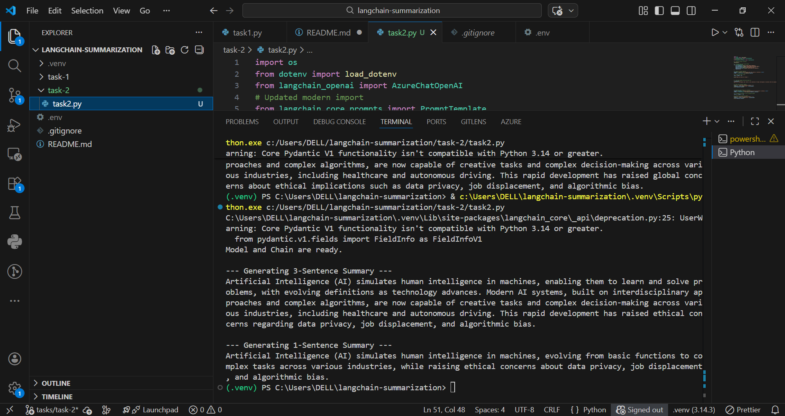
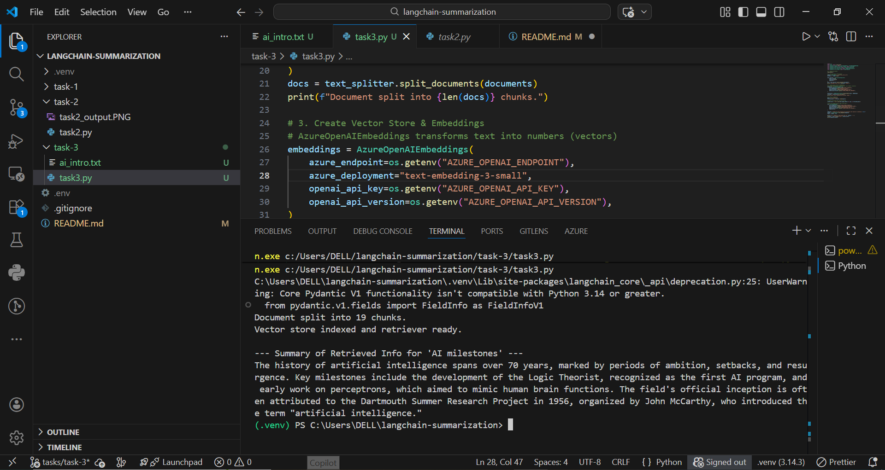

"# LangChain Summarization Project" 
"A project to master LangChain through structured tasks." 
"Contributor: - Aarib Ahmed Vahidy" 

## Task 1: Setup
Successfully configured the environment and verified Azure OpenAI credentials.

## Task 2: Prompt Templates and LLMChains
In this task, I configured an Azure OpenAI model using LangChain and designed a prompt template for text summarization. 

### Key Features:
* **Prompt Engineering:** Designed templates to restrict output to exactly 3 sentences vs. 1 sentence.
* **LCEL Implementation:** Built a chain using the `|` (pipe) operator to connect the prompt and the LLM.
* **Comparison:** Observed how the model condenses information differently based on sentence constraints.

### Comparison Results:
* **3-Sentence Summary:** Provides a balanced overview including AI definition, cross-disciplinary nature, and ethical implications.
* **1-Sentence Summary:** Focuses strictly on the core definition and the broad scope of AI evolution and ethics.

---
## Task 3: Retrievers and Vector Stores (RAG)
In this task, I implemented a basic Retrieval-Augmented Generation (RAG) pipeline. 

### Key Features:
* **Data Ingestion:** Used `TextLoader` to read a 500-word history of AI.
* **Text Splitting:** Utilized `CharacterTextSplitter` to create chunks of 200 characters (with 20-character overlap) to ensure the LLM receives context-rich fragments.
* **Vector Store:** Implemented an `InMemoryVectorStore` with `AzureOpenAIEmbeddings` to index the text chunks based on semantic meaning.
* **Retrieval-Based Summarization:** Queried the vector store for "AI milestones" and fed the retrieved context into a LangChain summarization chain.

### Output:
The model successfully identified key dates and events (Logic Theorist, Dartmouth Project 1956) from the text file and summarized them into exactly 3 sentences.

---
## Task 4: Creating an Agent for Summarization
In this task, I evolved the summarization chain into a dynamic AI Agent by wrapping it in a LangChain `Tool` and implementing a custom ReAct (Reasoning + Acting) loop.

### Key Features:
* **Custom Tool Creation:** Designed a `TextSummarizer` tool using prompt templates to enforce a strict 3-sentence limit.
* **Manual ReAct Loop:** Built a custom execution loop that parses the LLM's "Thought", "Action", and "Observation" outputs, effectively bypassing version-specific LangChain `AgentExecutor` import limitations.
* **Autonomous Decision Making:** Tested the agent's ability to recognize when to call the summarization tool based on explicit text versus vague requests ("Summarize something interesting").

